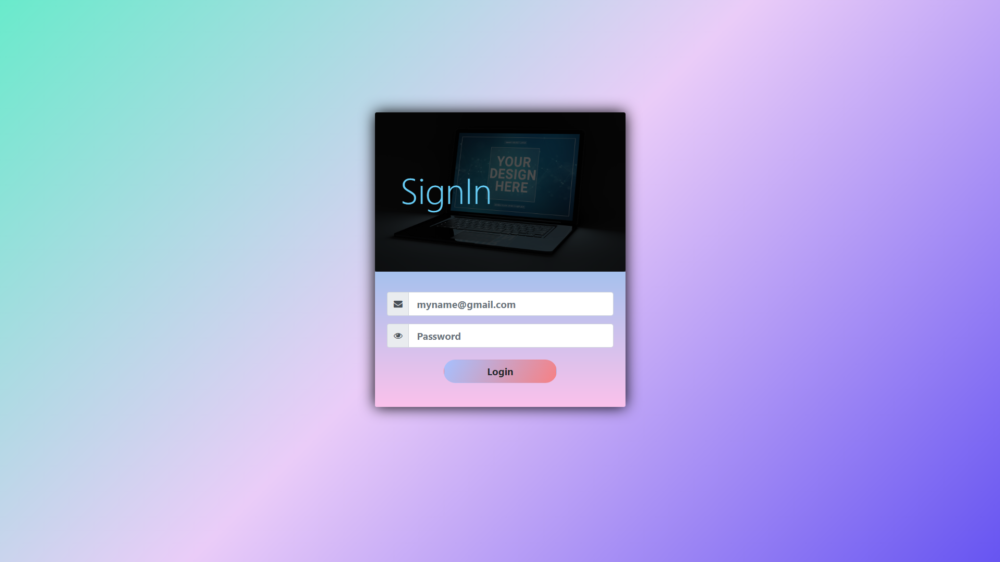

# FullSack20 Tasks 
> # SignUp Form Redesigned with Bootstrap

## Resources Used 
- **[Bootstrap](https://getbootstrap.com/, "Bootstrap Framework")**
- **[FontAwesome Icons](https://fontawesome.com, "FontAwesome Icons)**
- **[WebGradients](https://webgradients.com, "For Gradients")**
- **[UI Gradients](https://uigradients.com, "This also for gradients")**

- **JavaScript (For some adjustments of the form)**
- **CSS**
---

> # SignIn Form Designed with Bootstrap and Some other Online Resources

## Resources Used 
- **[Bootstrap](https://getbootstrap.com/, "Bootstrap Framework")**
- **[FontAwesome Icons](https://fontawesome.com, "FontAwesome Icons)**
- **[WebGradients](https://webgradients.com, "For Gradients")**
- **[UI Gradients](https://uigradients.com, "This also for gradients")**

- **JavaScript (For some adjustments of the form)**

- **CSS** 

---

